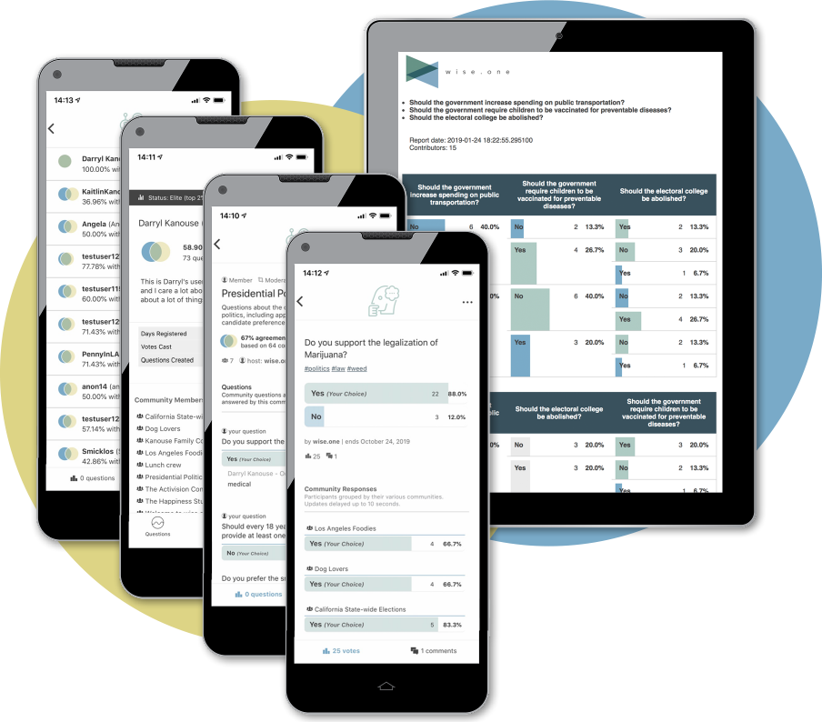

# Welcome to wise.one

## What is wise.one?

Wise.one is a research and reporting platform that provides an innovative new approach to collecting feedback from communities for data modeling and market segmentation projects. Users can join existing communities or create their own. They can create questions and choose which communities they would like to have respond. Communities can be private \(shared access code\) or public. Community owners can access engagement reports that dive deep into the opinions of their communities. Subscribers can download datasets containing vote records with correlated voter Ids \(anonymous, but consistent\) across all questions.

## Why should you use wise.one?

Most businesses do not have access to engagement channels that build analytically rich feedback relationships with their customers. If these business are not natively selling digital products or services, they rely predominantly on social media, online surveys, or marketing website analytics to extract insights about customer attitudes and opinions. All of these channels have constraints or conditions that limit the practical value of the data they produce when compared to what’s possible when using the right technology. The growth opportunity for most companies looking for richer customer insights is to extend consumer programs into feedback systems that offer scalable, real-time, location-aware engagement. This can be done using a new, dynamic, opinion polling network, acting in an open, data-rich environment that builds on itself as the user base grows, delivering value and insight to everyone that uses it.

Interest and demand for smart engagement marketing technologies has been steadily growing for the past 20 years. There are two key trends that make this the right time for a solution like wise.one:

1. Consumers are turning away from “traditional” social media as they increasingly feel subordinate to policies and practices regarding privacy and influence. I’m certain this trend will accelerate through 2020. The wise.one solution offers users an opportunity for authentic influence without compromising on their privacy concerns.
2. In reaction to the current political environment, we are beginning to see attitudes shift in favor of finding common ground and developing a better understanding of the attitudes and opinions of other communities. I’m certain this trend will also continue through 2020. The wise.one solution offers users the opportunity to gain a deeper understanding of each other through alignment profiles and community participation.

These two factors will provide organizations and analysts with the key to programmatic success with wise.one: an engaged install base. Strong signals that your company could benefit from wise.one include:

* Your company has a large portfolio of products or services that iterate quickly.
* Your business model involves frequent customer touch points.
* Your company has made investments in developing internal analytics capabilities to better understand their customers.

